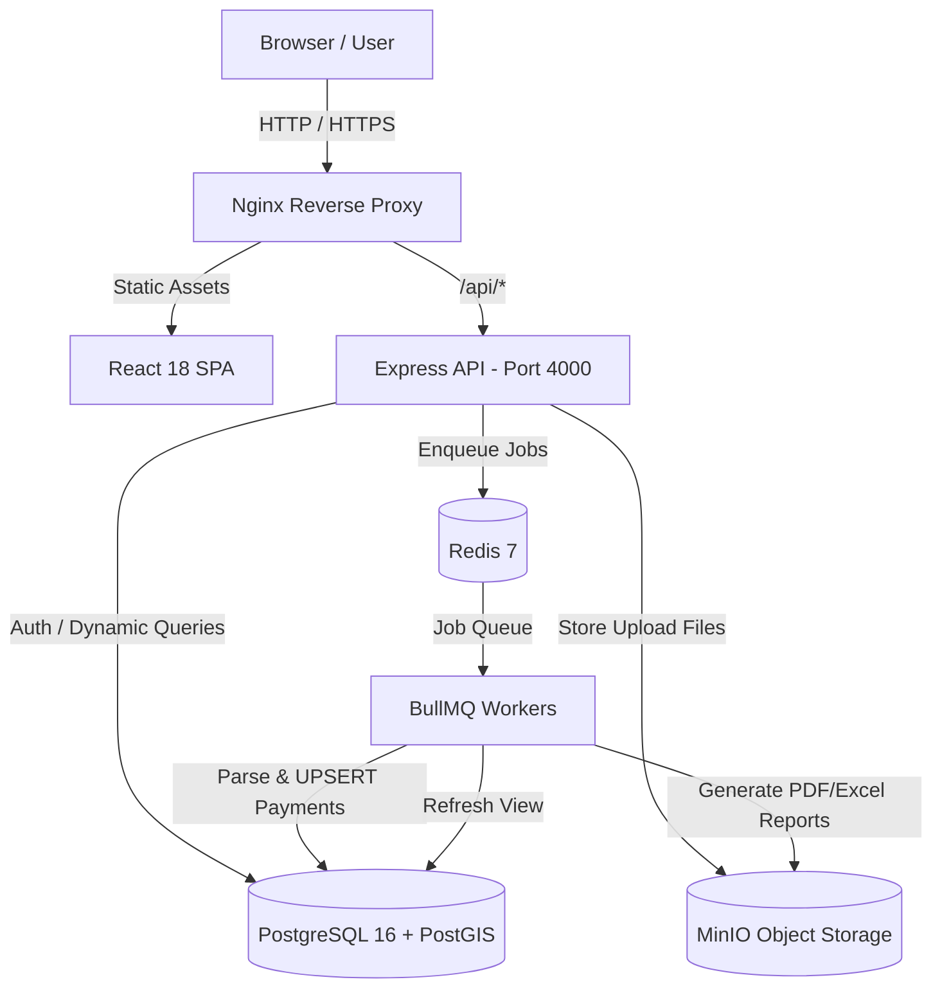
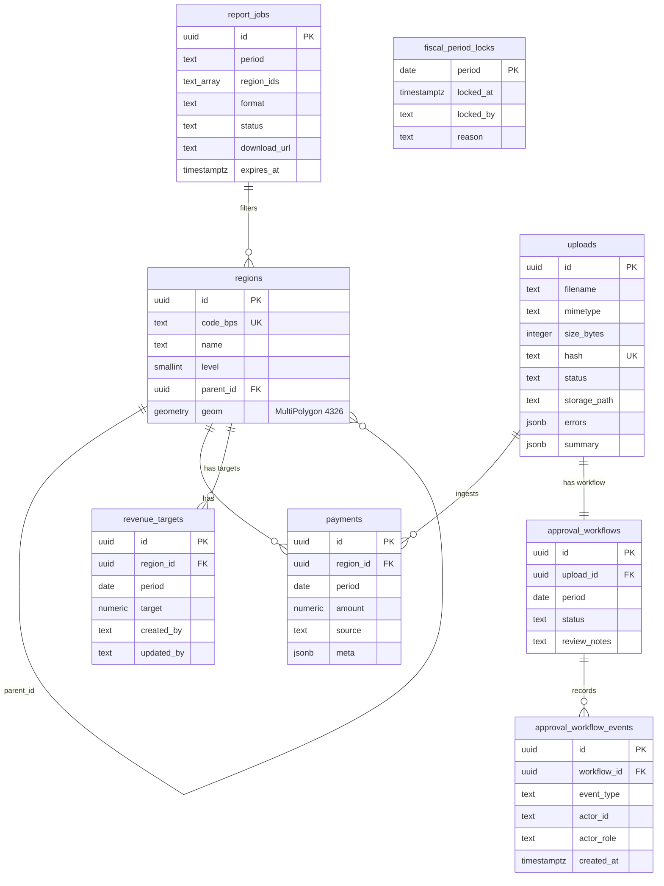
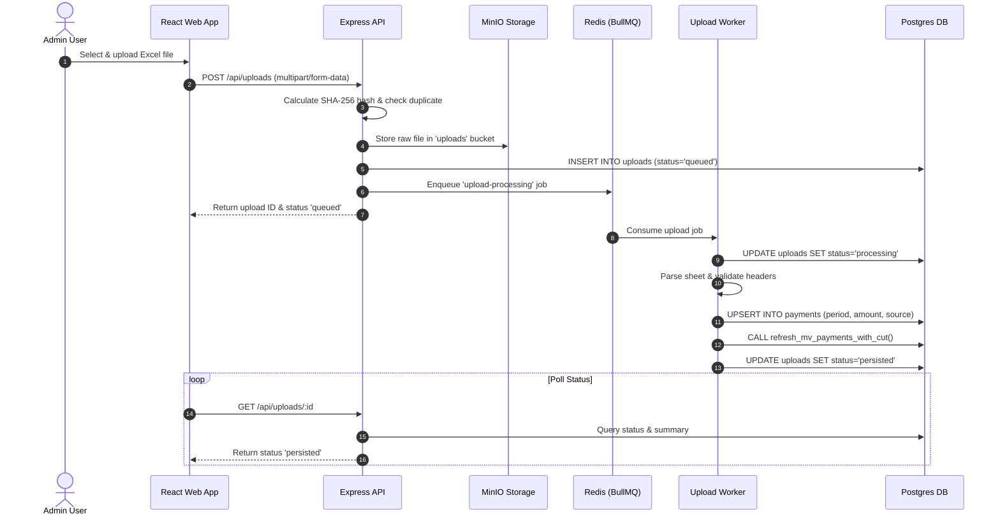
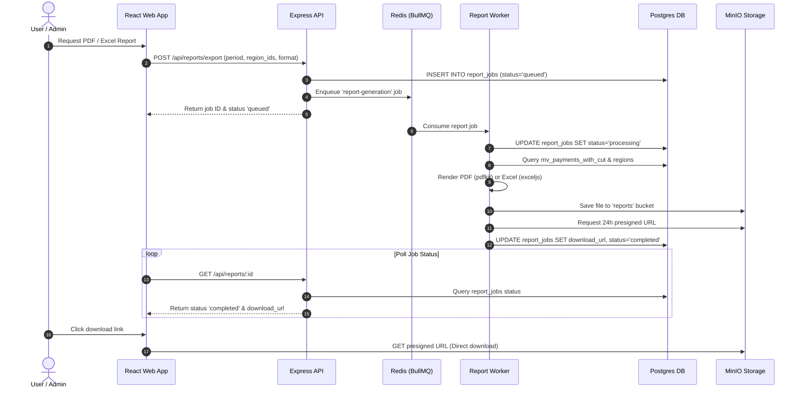

# Petakeu System Architecture

System architecture and component design document for **Petakeu**, an Indonesian regional fiscal visualization and financial tracking dashboard.

---

## 1. System Overview

Petakeu is a high-performance web platform designed to analyze, visualize, and report on regional fiscal revenue cuts and net distributions across administrative levels in Indonesia.

The repository is structured as a **Turborepo** monorepo managed with **pnpm workspaces**:

```
petakeu/
├── apps/
│   ├── server/               # Express + TypeScript REST API backend
│   │   ├── migrations/       # Sequential raw SQL migration scripts
│   │   └── src/
│   │       ├── config/       # Environment & Swagger configs
│   │       ├── controllers/  # Express HTTP request handlers
│   │       ├── db/           # Postgres, Redis, and MinIO clients
│   │       ├── jobs/         # BullMQ worker handlers (upload & report)
│   │       ├── middleware/   # Auth (JWT) & file upload (Multer)
│   │       ├── routes/       # API route modules (mounted at /api)
│   │       ├── services/     # Core domain business logic
│   │       ├── types/        # Shared TypeScript interface definitions
│   │       └── utils/        # Logger, metrics, error helpers
│   └── web/                  # React 18 + Vite frontend SPA
│       └── src/
│           ├── api/          # HTTP client
│           ├── components/   # Shared UI & layout components
│           ├── hooks/        # React Query custom data hooks
│           ├── pages/        # Page route components (MapDashboard, AdminDashboard, etc.)
│           └── lib/          # Utilities & formatting functions
├── docs/                     # Technical documentation & guides
├── monitoring/               # Prometheus rules and Grafana dashboard
├── docker-compose.dev.yml    # Local development container orchestration
└── docker-compose.prod.yml   # Production container orchestration
```

---

## 2. Architecture Diagram

### Request Flow Overview

The diagram below illustrates the end-to-end flow of network requests and background data processing:

```
Users → Nginx → React App (static)
                   ↓
             Express API (port 4000)
                /    |    \
         PgSQL  Redis  MinIO
                |
           BullMQ Workers
           (upload + report)
```

### Component Interaction (Mermaid)



---

## 3. Frontend Architecture

The frontend is a single-page application (SPA) built with **React 18** and **Vite**, configured for rapid rendering and interactive spatial visualization.

### Key Libraries & Responsibilities

| Tech / Library | Purpose & Responsibilities |
| :--- | :--- |
| **React 18** | UI framework utilizing functional components, hooks, and concurrent features. |
| **Vite** | Build tool and fast HMR development server. |
| **React Query (v5)** | Server-state management, caching, polling background jobs, and query invalidation. |
| **React Leaflet** | Geographic map rendering, choropleth layer generation, and spatial hover/click triggers. |
| **Recharts** | Rendering regional fiscal ranking charts, trend sparklines, and breakdown bar charts. |
| **Tailwind CSS v4** | Utility-first responsive styling and theme configuration. |

### Module & Page Organization

The application codebase is organized around route-level page views and reusable components:

*   [`pages/MapDashboard`](file:///home/noah/project/petakeu/apps/web/src/pages/MapDashboard.tsx): Interactive map workspace combining Leaflet choropleth layers, quantile legend scales, and period controls.
*   [`pages/AdminDashboard`](file:///home/noah/project/petakeu/apps/web/src/pages/AdminDashboard.tsx): Comparative fiscal ranking table, RankFin leagues, and DefisitWatch monitoring tabs.
*   [`pages/AnalyticsPage`](file:///home/noah/project/petakeu/apps/web/src/pages/AnalyticsPage.tsx): Executive KPI, trend, target, YoY, province-comparison, and reporting-matrix views.
*   [`pages/UploadPage`](file:///home/noah/project/petakeu/apps/web/src/pages/UploadPage.tsx): Regional revenue data upload interface and processing log table.

---

## 4. Backend Architecture

The backend is built with **Express 4** and **TypeScript**, following a clean **Controller → Service → Database/Storage** architecture.

```
Incoming Request
       │
  Middleware (auth.ts, upload.ts, error-handler)
       │
  Controller Layer (Extract params, validate schema)
       │
  Service Layer (Business logic, calculations, queue dispatch)
       │
  Data / Storage Access (PgPool, Redis, MinIO)
```

### Core Middleware

*   [`auth.ts`](file:///home/noah/project/petakeu/apps/server/src/middleware/auth.ts): Handles JWT Bearer token authentication (`requireAuth`) and role authorization (`requireRole`). Supports bypass via `AUTH_DISABLED=true` during local development.
*   [`request-context.ts`](file:///home/noah/project/petakeu/apps/server/src/middleware/request-context.ts): Propagates bounded `X-Request-Id` values and request-scoped user, region, period, and duration fields into logs and metrics.
*   [`upload.ts`](file:///home/noah/project/petakeu/apps/server/src/middleware/upload.ts): Configures **Multer** in-memory buffer storage for secure file validation and upload processing.
*   [`audit.ts`](file:///home/noah/project/petakeu/apps/server/src/middleware/audit.ts): Automatically records all mutative requests (`POST`, `PUT`, `PATCH`, `DELETE`) to the `audit_logs` table — capturing `user_id`, `action`, endpoint, IP address, and request metadata.

### API Route Structure

Application routes are mounted under `/api`:

| Route Endpoint | Module | Description |
| :--- | :--- | :--- |
| `/api/regions` | [`regions.ts`](file:///home/noah/project/petakeu/apps/server/src/routes/v1/regions.ts) | Administrative region metadata and parent-child hierarchy queries. |
| `/api/geo` | [`geo.ts`](file:///home/noah/project/petakeu/apps/server/src/routes/v1/geo.ts) | Spatial GeoJSON boundaries and choropleth metrics payloads (Redis-cached). |
| `/api/uploads` | [`uploads.ts`](file:///home/noah/project/petakeu/apps/server/src/routes/v1/uploads.ts) | Spreadsheet upload ingestion, hash verification, and job status. |
| `/api/reports` | [`reports.ts`](file:///home/noah/project/petakeu/apps/server/src/routes/v1/reports.ts) | Report job queuing and presigned download URL retrieval. |
| `/api/rankfin` | [`rankfin.ts`](file:///home/noah/project/petakeu/apps/server/src/routes/v1/rankfin.ts) | Fiscal ranking calculations and sortable summaries (Redis-cached). |
| `/api/defisitwatch` | [`defisitwatch.ts`](file:///home/noah/project/petakeu/apps/server/src/routes/v1/defisitwatch.ts) | Regional surplus and deficit monitoring statistics (Redis-cached). |
| `/api/audit-logs` | [`audit.ts`](file:///home/noah/project/petakeu/apps/server/src/routes/v1/audit.ts) | Immutable audit log query endpoint (admin role required). |
| `/api/analytics` | [`analytics.ts`](file:///home/noah/project/petakeu/apps/server/src/routes/v1/analytics.ts) | Executive analytics overview and revenue-target APIs (`viewer+` reads, `operator+` writes). |
| `/api/approvals` | [`approvals.ts`](file:///home/noah/project/petakeu/apps/server/src/routes/v1/approvals.ts) | Upload approval transitions and fiscal-period lock/unlock actions. |

---

## 5. Database Layer

Petakeu uses **PostgreSQL 16** with the **PostGIS 3.4** extension for spatial data operations.

### Key Tables



### Materialized View (`mv_payments_with_cut`)

The database utilizes a materialized view to pre-calculate fiscal deductions and quantile classifications per period:

*   **Calculated Fields**:
    *   `amount`: Aggregated gross payment.
    *   `cut_amount`: Regional cut amount ($15\%$ of gross payment).
    *   `net_amount`: Net distributed payment ($85\%$ of gross payment).
    *   `class_index`: Quantile bin index ($0$ to $4$) computed via `NTILE(5)` over the period.
    *   `bins`: JSON array of period quantile boundary minimums and maximums.
*   **Refresh Strategy**:
    *   **Scheduled**: Periodic cron task ([`mv-refresh-cron.ts`](file:///home/noah/project/petakeu/apps/server/src/jobs/mv-refresh-cron.ts)) triggers concurrent refresh every 15 minutes.
    *   **On-Demand**: Triggered immediately upon completion of an Excel upload batch.

### Migration Management

Database migrations are stored as sequential SQL files in [`apps/server/migrations/`](file:///home/noah/project/petakeu/apps/server/migrations/) and executed automatically on startup via [`db/migrate.ts`](file:///home/noah/project/petakeu/apps/server/src/db/migrate.ts):

| File | Description |
| :--- | :--- |
| `001_init.sql` | Core schema: `regions`, `payments`, `mv_payments_with_cut`, PostGIS setup |
| `002_uploads_reports.sql` | Upload tracking (`uploads`) and report job (`report_jobs`) tables |
| `003_gamification.sql` | Gamification league tables and scoring schema |
| `004_audit_logs.sql` | Immutable audit trail (`audit_logs`) table with indexes |
| `005_analytics_targets.sql` | Monthly `revenue_targets` used by the analytics read model |
| `006_approval_workflow.sql` | Approval workflow/event history, fiscal-period locks, and write-protection triggers |

---

## 6. Background Jobs & Worker Queue

Asynchronous background processes are powered by **BullMQ** running on **Redis 7**.

### Queue Summary

```
                      ┌──────────────────────┐
                      │    Redis Queue       │
                      └──────────┬───────────┘
                                 │
                 ┌───────────────┴───────────────┐
                 ▼                               ▼
       ┌──────────────────┐            ┌──────────────────┐
       │ upload-processing│            │ report-generation│
       └─────────┬────────┘            └─────────┬────────┘
                 │                               │
                 ▼                               ▼
      • Parse XLSX / CSV              • Query aggregated data
      • Header validation             • Render PDF (pdfkit)
      • DB UPSERT payments            • Render Excel (exceljs)
      • Refresh Materialized View     • Upload to MinIO bucket
```

1.  **Upload Processing Worker** ([`upload-worker.ts`](file:///home/noah/project/petakeu/apps/server/src/jobs/upload-worker.ts)):
    *   Ingests uploaded Excel/CSV file buffers.
    *   Validates mandatory header columns (`kode_bps`, `nama_wilayah`, `periode`, `nominal`, `sumber`).
    *   **Future Period Flag**: Tags payments with `meta: { forecast: false }` when the period exceeds `CURRENT_DATE`, without rejecting valid historic records.
    *   Performs bulk `UPSERT` into the `payments` table using a unique index on `(region_id, period, source)`.
    *   Triggers `refresh_mv_payments_with_cut()` to update choropleth metrics.
    *   **Cache Invalidation**: Clears Redis cache keys for choropleth, region summaries, fiscal, defisitwatch, and rankfin after successful processing.

2.  **Report Generation Worker** ([`report-worker.ts`](file:///home/noah/project/petakeu/apps/server/src/jobs/report-worker.ts)):
    *   Queries `mv_payments_with_cut` and `regions` for specified periods and region filters.
    *   Fetches **Top 10 regional rankings** with year-over-year (YoY) net amount comparison.
    *   Generates **PDF** documents (using `pdfkit`) with a full payment table and a ranked Top-10 section showing `+/-YoY%`.
    *   Generates **Excel** files (using `exceljs`) with two worksheets: per-region payment summary and colour-coded Top-10 Rankings.
    *   Uploads output files to MinIO and generates a 24-hour presigned URL.
    *   Stores `top10Rankings` in the `report_jobs.summary` JSON field.

### Failure Handling & Retries

*   Queues are configured with **3 automatic retry attempts**.
*   Failed jobs use **exponential backoff** to handle transient database locks or network delays gracefully.

---

## 7. Object Storage

Petakeu integrates **MinIO** as an S3-compatible object storage layer.

### Bucket Structure

*   `uploads`: Stores raw submitted spreadsheet files (`.xlsx`, `.csv`).
*   `reports`: Stores generated output files (`.pdf`, `.xlsx`).

### Security & Deduplication

*   **Presigned URLs**: Direct access to raw objects is prohibited. Files are served exclusively via presigned download URLs with a 24-hour expiration window.
*   **SHA-256 Deduplication**: Uploaded files are hashed (`SHA-256`). Re-uploading an identical file returns existing metadata, preventing duplicate processing.

---

## 8. Caching Strategy

Petakeu uses **Redis 7** as both the BullMQ job broker and the application-level read cache. All caches are implemented through the `getCached<T>()` helper in [`db/redis.ts`](file:///home/noah/project/petakeu/apps/server/src/db/redis.ts), which automatically records `petakeu_cache_hits_total` and `petakeu_cache_misses_total` Prometheus counters.

| Cache Key Pattern | Service | Default TTL | Invalidated By |
| :--- | :--- | :--- | :--- |
| `choropleth:{period}:{level}:{parent}` | `geo-service` | 1 hour | Upload completion, MV cron refresh |
| `region:list` | `region-service` | 5 min | Upload completion, MV cron refresh |
| `summary:{regionId}:{from}:{to}` | `region-service` | 5 min | Upload completion, MV cron refresh |
| `fiscal:{...params}` | `fiscal-service` | 5 min | Upload completion, MV cron refresh |
| `defisitwatch:{...params}` | `defisitwatch-service` | 5 min | Upload completion, MV cron refresh |
| `rankfin:{...params}` | `rankfin-service` | 5 min | Upload completion, MV cron refresh |

---

## 9. Observability

Application telemetry is exposed without coupling the API to a vendor-specific backend:

*   `GET /metrics` exposes Prometheus metrics for HTTP latency, database and Redis operations, cache hit/miss rates, worker jobs, upload parsing, reports, and GeoJSON payload sizes.
*   `GET /healthz` and `GET /ready` cover service health and readiness; `GET /live` provides a liveness probe.
*   Pino JSON logs receive the request context from `request-context.ts`, and BullMQ workers use the same structured logger.
*   OpenTelemetry instruments HTTP, PostgreSQL, Redis, and worker execution when tracing is enabled.
*   Deployable alert rules and a dashboard are maintained in `monitoring/prometheus-rules.yml` and `monitoring/grafana-dashboard.json`.

---

## 10. Authentication & Authorization

Authentication is based on **JWT (JSON Web Tokens)** transmitted via the `Authorization: Bearer <token>` header.

### Middleware Control Flow

```
Request → requireAuth → Is AUTH_DISABLED=true? ──Yes──> Assign Dev User (Role: Admin) → Next()
                              │
                              No
                              ▼
                    Validate JWT Signature
                              │
                    Valid? ───┼──Yes──> req.user = payload ──> requireRole(role)? ──> Next()
                              │
                             No
                              ▼
                     Return HTTP 401 / 403
```

*   **Dev Mode**: Setting `AUTH_DISABLED=true` injects a synthetic admin user (`sub: 'dev-user'`, `role: 'admin'`) for local sandbox testing.
*   **Role Enforcement**: The hierarchy is `public` → `viewer` → `operator` → `admin`. Analytics reads require `viewer+`, target registration and approval submission/review require `operator+`, and approval/publish/period-lock actions require `admin`.

---

## 11. Deployment

Deployment is containerized using **Docker Compose**, with environment-specific configurations:

*   [`docker-compose.dev.yml`](file:///home/noah/project/petakeu/docker-compose.dev.yml): Mounts local source code for live hot-reloading across web and server.
*   [`docker-compose.prod.yml`](file:///home/noah/project/petakeu/docker-compose.prod.yml): Multi-stage production builds with resource limits, Nginx static file serving, and production Redis settings.

### Service Overview

| Service Name | Base Image / Build Target | Exposed Ports | Internal Communication |
| :--- | :--- | :--- | :--- |
| `web` | `nginx:alpine` (Prod) / `vite` (Dev) | `80:80` / `5173:5173` | Communicates with `api` backend |
| `api` | `node:20-alpine` | `4000:4000` | Connects to Postgres, Redis, and MinIO |
| `postgres` | `postgis/postgis:16-3.4` | `5432:5432` | Relational database & spatial store |
| `redis` | `redis:7-alpine` | `6379:6379` | BullMQ message broker |
| `minio` | `quay.io/minio/minio` | `9000:9000`, `9001:9001` | S3 object storage server & console |

---

## 12. Key Data Flows

### Flow 1: Excel Data Upload & Ingestion



### Flow 2: Async Report Generation & Download


