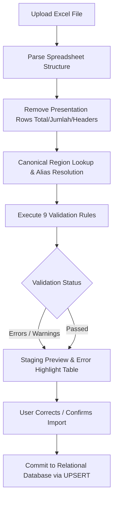
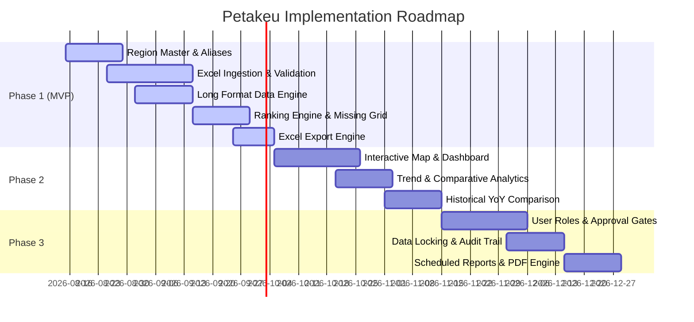

# Product Requirements Document (PRD) — Petakeu

**Project**: Petakeu — Regional Fiscal Revenue Monitoring Platform  
**Target Domain**: Indonesian GovTech / Public Sector Fiscal Analytics  
**Status**: Draft / Version 1.0  
**Last Updated**: 2026-08-11  

---

## 1. Overview

**Petakeu** is a specialized GovTech platform designed to monitor regional fiscal revenue (*Pendapatan Asli Daerah* / PAD) across Indonesia's 38 provinces and 514 regencies and cities (*Kabupaten/Kota*). The platform replaces fragile, manual Excel-based revenue tracking workflows with a centralized web solution featuring an interactive map dashboard, automated multi-stage spreadsheet data ingestion, canonical region name resolution, dynamic ranking calculation engines, missing-data analysis tools, and bidirectional report generators. By transitioning regional financial tracking from unstructured spreadsheets to a relational, long-format data store, Petakeu enables government fiscal analysts to gain real-time visibility into revenue collection performance, detect reporting anomalies, and accelerate decision-making across all administrative tiers.

---

## 2. Problem Statement

Regional revenue monitoring currently relies on regional finance officers and fiscal analysts submitting and manually collating ad-hoc Microsoft Excel workbooks. This operational workflow exhibits major structural vulnerabilities:

*   **Manual Data Entry & High Operational Friction**: Fiscal analysts spend hundreds of hours every reporting cycle manually copying, pasting, and re-formatting revenue values submitted by local government entities.
*   **Dirty & Unstandardized Region Names**: Spreadsheets routinely contain inconsistent string names (e.g., `Kal-Barat`, `Sul-Teng`, `Papua barat`, `Sul-Tenggara`), breaking formula lookups (`VLOOKUP`, `INDEX/MATCH`) and requiring manual cell-by-cell remediation.
*   **Absence of Automated Validation**: Legacy spreadsheets lack entry controls, permitting duplicate entries, invalid numeric formats, negative revenue values, unverified calculations (e.g., 15% provincial revenue share mismatches), and unmapped regions to pass silently into executive reports.
*   **Static Analytics & Formula Fragility**: Ranking regions or evaluating target achievement requires manual sorting and formula alterations on presentation sheets. Altering filters or date ranges risks corrupting formula links.
*   **Lack of Missing-Data Tracking**: Spreadsheets fail to distinguish between missing/unsubmitted reports (`NULL`) and valid zero revenue entries (`0`), leading to incomplete submissions being reported as zero revenue and skewing regional performance rankings.
*   **Architectural Anti-Pattern ("Excel-as-Everything")**: Microsoft Excel is being forced to function simultaneously as a database, ETL pipeline, calculation engine, analytics platform, and executive presentation tool. This leads to version sprawl, data corruption, zero auditability, and massive loss of organizational efficiency.

### Comparison Matrix: Legacy Excel Workflow vs. Petakeu Platform

| Workflow Dimension | Legacy Excel Workflow | Petakeu Platform Solution |
| :--- | :--- | :--- |
| **Data Ingestion** | Manual copy-paste across multiple `.xlsx` sheets | Automated multi-stage upload parser with dry-run preview |
| **Region Naming** | Inconsistent raw text (`Kal-Barat`, `Sul-Teng`) | Canonical BPS regional master with alias lookup engine |
| **Data Quality** | Manual visual inspection; silent calculation bugs | Automated 9-rule validation engine with interactive errors |
| **Data Schema** | Wide presentation grids (`Jan`, `Feb`, `Mar` columns) | Long-format relational model (`region_id`, `period`, `amount`) |
| **Missing Data** | Blanks, zeroes, and hyphens mixed ambiguously | Explicit first-class modeling of `NULL` (Missing) vs `0` (Zero) |
| **Rankings** | Manual sorting; static formula blocks | Real-time dynamic ranking engine (Total, Target %, Surplus) |
| **Reporting** | Fragile sheet linking; manual copy to slides | Interactive matrix dashboard + Bidirectional Excel/PDF export |

---

## 3. Target Users

Petakeu serves two core public sector user groups involved in Indonesian regional fiscal administration:

### 1. Fiscal Analysts (BPKAD / Kemendagri)
*   **Organization**: Regional Financial and Asset Management Agency (*Badan Pengelola Keuangan dan Aset Daerah* / BPKAD) and Ministry of Home Affairs (*Kementerian Dalam Negeri* / Kemendagri).
*   **Role & Responsibilities**: National and provincial monitoring of regional fiscal performance, evaluating target achievement across *Kabupaten/Kota*, detecting underperforming regions, identifying missing reports, and preparing executive briefs for leadership.
*   **Primary Platform Needs**: Real-time KPI dashboards, automated ranking engines, missing-data audit matrices, dynamic filtering by province and period, and instant export of presentation-ready summaries.

### 2. Provincial Government Operators
*   **Organization**: Provincial Revenue Offices (*Badan Pendapatan Daerah* / Bapenda) and Regional Secretariat Fiscal Units.
*   **Role & Responsibilities**: Ingesting monthly revenue submissions (*Setoran*) from regencies and cities, verifying calculations (gross revenue, 15% provincial revenue share /*bagi hasil*, net revenue), and consolidating provincial revenue records.
*   **Primary Platform Needs**: Streamlined Excel importer with error feedback, canonical region matching, quick cell-level data correction interfaces, and monthly compliance tracking grids.

---

## 4. Goals & Success Metrics

The primary goal of Petakeu is to digitize and automate regional revenue ingestion, validation, and analytics to achieve total data accuracy and operational speed.

```
┌─────────────────────────────────────────────────────────────────────────────┐
│                           PETAKEU SUCCESS GOALS                             │
├──────────────────────────┬──────────────────────────┬───────────────────────┤
│   OPERATIONAL SPEED      │       DATA QUALITY       │  COVERAGE VISIBILITY  │
│   >90% Time Reduction    │ 0 Calculation Errors     │ 100% Tracking of      │
│   In Data Ingestion      │ Via Validation Engine    │ Missing Submissions   │
└──────────────────────────┴──────────────────────────┴───────────────────────┘
```

### Quantitative & Qualitative Metrics

| Target Area | Metric Description | Legacy Baseline | Petakeu Target | Measurement Method |
| :--- | :--- | :--- | :--- | :--- |
| **Operational Efficiency** | Time required to process monthly regional revenue uploads | 15–20 hours per monthly cycle | **< 15 minutes** per monthly cycle | Ingestion completion timer logs |
| **Data Quality** | Rate of undetected region name mismatches and calculation errors | ~12% error rate in reported workbooks | **0%** (100% resolved prior to database commit) | Staging validation error logs |
| **Reporting Coverage** | Real-time visibility of unsubmitted regional reports | Manual audit requiring days of visual sheet inspection | **Instant** (100% coverage matrix updated upon upload) | Missing Data matrix page load |
| **Query Performance** | Time to recalculate nationwide rankings across custom periods | 30+ minutes (manual formula adjustment) | **< 200 ms** per dynamic query | API response time metrics |
| **User Transition** | Export format compatibility for executive presentations | Manual template copy-pasting | **100% format fidelity** in exported Excel/PDF | Executive report compliance check |

---

## 5. Functional Requirements

### 5.1 Data Import Module

The Data Import engine ingests raw Microsoft Excel files (`.xlsx`, `.xls`), removes presentation artifacts, maps region names, runs mathematical validations, and presents a dry-run preview before committing records to long-format storage.



#### Multi-Stage Ingestion Pipeline
1. **Upload**: User selects and uploads a monthly revenue workbook.
2. **Parse**: Extract raw sheet rows, stripping presentation metadata (e.g., header banners, `Total`, `Jumlah`, provincial section dividers such as `Prop. Sulawesi Utara`).
3. **Preview**: Display row-by-row staging table showing parsed values: Period (`YYYY-MM`), Province, Regency/City, Gross Setoran, Provincial Share (15%), Net Revenue, and Target.
4. **Validate**: Execute automatic data validation rules across every staged row.
5. **Confirm Import**: User reviews valid, warning, and error rows, applying quick edits or alias additions before executing database commit.

#### Automated Validation Checks

| Error / Warning Type | Rule Trigger Condition | Error Level | Resolution Action |
| :--- | :--- | :--- | :--- |
| **Unknown Province** | Raw province string does not match any canonical province or alias | **Blocking Error** | Prompt user to map raw string to canonical province or add new alias |
| **Unknown Regency/City** | Raw regency string does not match any canonical regency or alias | **Blocking Error** | Prompt user to map raw string to canonical regency or add new alias |
| **Province-Region Mismatch** | Regency belongs to Province A in master data, but Excel places it under Province B | **Blocking Error** | Highlight mismatch; require operator correction |
| **Duplicate Entry** | A record for the exact `region_id` and `period` already exists in database | **Warning** | Flag for UPSERT overwrite confirmation |
| **Missing Amount** | Amount field is completely blank/empty | **Warning** | Classify as `NULL` (Missing Report) |
| **Invalid Number** | Currency field contains non-numeric text or malformed characters | **Blocking Error** | Require user to supply valid numeric value |
| **Negative Amount** | Gross setoran or share value is negative (`< 0`) | **Blocking Error** | Require verification and user correction |
| **15% Calculation Mismatch** | `abs(province_share - (gross_setoran * 0.15)) > tolerance` | **Warning / Error** | Flag calculation mismatch; display calculated vs provided values |
| **Net Amount Mismatch** | `abs(net_amount - (gross_setoran - province_share)) > tolerance` | **Warning / Error** | Flag net mismatch; display computed expectation |

---

### 5.2 Region Master Module

The Region Master serves as the single source of truth for geographical administrative units in Indonesia, adhering to official BPS (*Badan Pusat Statistik*) codes.

*   **Canonical Hierarchy**:
    *   **Provinces (`provinces`)**: BPS 2-digit code (e.g., `33` → Jawa Tengah, `62` → Kalimantan Tengah).
    *   **Regencies & Cities (`regions`)**: BPS 4-digit code (e.g., `3319` → Kabupaten Kudus, `3371` → Kota Magelang), linked to parent `province_id`, with explicit designation of administrative type (`Kabupaten` vs `Kota`).
*   **Alias Table (`region_aliases`)**:
    *   Dynamic mapping layer matching messy, legacy, or abbreviated Excel strings to canonical database entities.
    *   *Example Mappings*:

| Raw Excel String | Canonical Target Name | Target Administrative Unit | BPS Code |
| :--- | :--- | :--- | :--- |
| `Kal-Barat` | Kalimantan Barat | Province | `61` |
| `Kalbar` | Kalimantan Barat | Province | `61` |
| `KAL BARAT` | Kalimantan Barat | Province | `61` |
| `Sul-Teng` | Sulawesi Tengah | Province | `72` |
| `Sul-Tenggara` | Sulawesi Tenggara | Province | `74` |
| `Sul-Utara` | Sulawesi Utara | Province | `71` |
| `Banjar Masin` | Kota Banjarmasin | Regency/City | `6371` |

---

### 5.3 Dashboard & Visualization Module

The primary dashboard provides immediate executive visibility into revenue collections, target progress, regional rankings, and monthly trends.

```
┌─────────────────────────────────────────────────────────────────────────────┐
│ CONTRIBUTION REVENUE DASHBOARD                                              │
│ Period: [ Jan 2025 ] ──> [ Jul 2025 ]     Province: [ Kalimantan Tengah ▼ ] │
├───────────────┬───────────────┬───────────────┬───────────────┬─────────────┤
│  Rp 11.90 B   │  Rp 19.40 B   │     61.3%     │       7       │  38 / 38    │
│  Received     │  Target       │  Achievement  │  Missing Rpts │  Provinces  │
├───────────────┴───────────────┴───────────────┴───────────────┴─────────────┤
│ REVENUE TREND (MONTHLY CUMULATIVE)                                          │
│  [Line Chart: Setoran Actual vs. Monthly Target Baseline across Jan-Jul]   │
├───────────────────────────────────────┬─────────────────────────────────────┤
│ TOP 10 PERFORMING REGIONS             │ BOTTOM 10 PERFORMING REGIONS        │
│ 1. Kota Waringin Barat   (83.2%)      │ 1. Barito Utara           (28.4%)   │
│ 2. Kota Palangka Raya    (63.7%)      │ 2. Kabupaten Kapuas       (31.0%)   │
│ 3. Pulang Pisau          (62.1%)      │ 3. Katingan               (34.2%)   │
├───────────────────────────────────────┴─────────────────────────────────────┤
│ ACTUAL VS TARGET COMPARISON                                                 │
│  [Grouped Bar Chart: Horizontal bars showing Target vs Actual per Region]   │
└─────────────────────────────────────────────────────────────────────────────┘
```

#### Dashboard UI Components
1. **KPI Scorecards**:
   *   **Total Revenue Received**: Sum of actual gross setoran in active period filter.
   *   **Total Target Allocation**: Cumulative revenue target for selected regions/period.
   *   **Target Achievement Percentage**: `(Total Actual / Total Target) * 100`.
   *   **Missing Submissions Count**: Total count of expected but unsubmitted monthly reports (`NULL`).
2. **Revenue Trend Chart (Line Chart)**:
   *   Monthly time-series displaying total revenue collected per month across selected period range.
3. **Top & Bottom Regions (Rank Cards / Bar Charts)**:
   *   Top 5/10 and Bottom 5/10 regions by total revenue or achievement percentage.
4. **Actual vs. Target Grouped Bar Chart**:
   *   Comparative bar visualization per region contrasting Target budget allocation against actual Setoran received.

---

### 5.4 Ranking Engine Module

The Ranking Engine computes dynamic regional rankings on the fly from long-format storage without modifying underlying tables or formulas.

#### Ranking Criteria Options
Users can select and rank regions by any of the following 6 criteria:
1. **Total Revenue (`SUM(gross_amount)`)**: Absolute financial contribution.
2. **Average Monthly Revenue (`AVG(gross_amount)`)**: Mean monthly collection rate.
3. **Target Achievement Percentage (`(SUM(actual) / SUM(target)) * 100`)**: Relative performance against target budget.
4. **Growth Percentage (`((Current_Period - Prior_Period) / Prior_Period) * 100`)**: Period-over-period revenue growth.
5. **Largest Surplus (`actual - target > 0`)**: Highest positive difference above target allocation.
6. **Largest Deficit (`actual - target < 0`)**: Largest negative shortfall below target allocation.

#### Dynamic Filtering Controls
*   **Province Filter**: Multi-select dropdown (All Indonesia, single province, or selected comparative provinces).
*   **Period Range Filter**: Date range picker (e.g., `2025-01` to `2025-07`).
*   **Metric Filter**: Selection of gross revenue, 15% provincial share, net revenue, or achievement percentage.

---

### 5.5 Missing Data Analysis Module

Petakeu treats missing submissions as a first-class operational domain, preventing unsubmitted reports from skewing financial analytics.

```
┌─────────────────────────────────────────────────────────────────────────────┐
│ MISSING DATA ANALYSIS & PROVINCIAL COVERAGE OVERVIEW                        │
├───────────────────┬───────────┬──────────────┬──────────────┬───────────────┤
│ Province          │ Expected  │ Complete     │ Missing      │ Coverage %    │
├───────────────────┼───────────┼──────────────┼──────────────┼───────────────┤
│ Jawa Tengah       │ 245       │ 217          │ 28           │  88.6%        │
│ Jawa Barat        │ 189       │ 140          │ 49           │  74.1%        │
│ Kalimantan Barat  │ 98        │ 42           │ 56           │  42.8%        │
└───────────────────┴───────────┴──────────────┴──────────────┴───────────────┘
```

#### Modeling Rules: NULL vs. Zero Revenue
To preserve statistical integrity:
*   **`NULL` (Unsubmitted / Missing)**: Indicates no revenue report was submitted by the regional authority for the period. Excluded from average calculations; flagged as non-compliant.
*   **`0` (Reported Zero)**: Indicates a formal revenue report was submitted confirming exactly `Rp 0` in revenue collected. Included in analytics and averages.

#### Visual Indicators
*   `✅` **Complete**: Report submitted and verified valid.
*   `❌` **Missing (`NULL`)**: Report unsubmitted for period.
*   `⚠` **Invalid / Warning**: Report submitted but contains validation warnings (e.g., share calculation discrepancy).

---

### 5.6 Reporting Matrix Module

The Reporting Matrix provides a complete interactive Region × Month grid across selected administrative regions.

```
┌─────────────────────────────────────────────────────────────────────────────┐
│ REGIONAL REPORTING MATRIX — KALIMANTAN TENGAH (2025)                         │
├─────────────────────┬───┬───┬───┬───┬───┬───┬───┬───────────────┬───────────┤
│ Region              │Jan│Feb│Mar│Apr│May│Jun│Jul│ Period Total  │ Status    │
├─────────────────────┼───┼───┼───┼───┼───┼───┼───┼───────────────┼───────────┤
│ Kotawaringin Barat  │ ✅ │ ✅ │ ✅ │ ✅ │ ✅ │ ✅ │ ✅ │ Rp 4,002.0 M  │ Complete  │
│ Palangka Raya       │ ✅ │ ✅ │ ✅ │ ✅ │ ✅ │ ✅ │ ✅ │ Rp 3,021.0 M  │ Complete  │
│ Pulang Pisau        │ ✅ │ ✅ │ ⚠ │ ✅ │ ✅ │ ✅ │ ✅ │ Rp 1,946.5 M  │ Attention │
│ Barito Utara        │ ✅ │ ❌ │ ❌ │ ✅ │ ✅ │ ❌ │ ✅ │ Rp   920.0 M  │ Missing 3 │
└─────────────────────┴───┴───┴───┴───┴───┴───┴───┴───────────────┴───────────┘
```

*   **Interactive Cell Detail Modal**: Clicking any status cell in the matrix opens a side drawer detailing:
    *   Region Name and BPS Code
    *   Reporting Period (`YYYY-MM`)
    *   Gross Setoran, Provincial Share (15%), Net Amount, Target Amount
    *   Import Batch Metadata (`filename`, `imported_by`, `imported_at`)
    *   Validation Status & Warning Logs

---

### 5.7 Export Engine

Petakeu maintains complete operational compatibility with executive legacy workflows via a robust bidirectional export module.

*   **Export Formats**:
    *   **Excel (`.xlsx`)**: Generates formatted workbooks featuring Executive Summary, Regional Rankings, Monthly Revenue Breakdown, Target Achievement, and Missing Data Audit sheets. Match standard government layout styles out of the box.
    *   **PDF Reports (`.pdf`)**: Generates clean executive presentation summaries complete with scorecards, trend charts, and ranking tables.
*   **Bidirectional Interoperability**:
    *   **App → Excel**: Export analytical results and dynamic ranking views to Excel for offline distribution.
    *   **Excel → App**: Ingest updated offline spreadsheets directly back into the platform with zero data loss or structural schema mismatch.

---

## 6. Non-Functional Requirements

### 6.1 Performance Requirements
*   **API Response Time**: Dynamic ranking and matrix API endpoints must respond within **< 200 ms** for standard queries under concurrent load.
*   **Import Parsing Throughput**: Ingestion, parsing, alias mapping, and validation of 500 row spreadsheets must complete within **< 3 seconds**.
*   **Dashboard Page Load**: Initial dashboard interactive render within **< 1.0 second**.

### 6.2 Security & Authentication
*   **Session Management**: JSON Web Token (JWT) based authentication for secure API requests.
*   **Transport Security**: Standard HTTPS (TLS 1.3) encryption for all client-server communications.
*   **Input Sanitization**: Strict parameter validation on upload payloads to prevent SQL injection, path traversal, or remote file execution vulnerabilities.

### 6.3 Data Integrity & Storage Model
*   **Relational Long-Format Architecture**: All financial records stored in a normalized long format (`region_id`, `period_id`, `gross_amount`, `share_amount`, `net_amount`, `target_amount`).
*   **UPSERT Idempotency**: Re-importing a corrected file for an existing region and period executes an atomic `UPSERT` (Insert or Update on Conflict), eliminating duplicate records.
*   **Database Constraints**: Strict foreign keys linking revenue reports to canonical region codes and report periods.

### 6.4 Audit Trail & Ingestion Logging
*   **Import Batch Tracking**: Every upload creates an `import_batches` record logging:
    *   Batch ID (`UUID`)
    *   File name & file size
    *   Import timestamp (`imported_at`)
    *   Operator ID (`imported_by`)
    *   Row execution metrics (total, valid, invalid counts)
*   **Validation Error Log**: Detailed table (`import_errors`) preserving specific row numbers, raw text inputs, and validation failure reasons for historical auditing.

---

## 7. Out of Scope (MVP / Phase 1)

To ensure rapid delivery of core revenue collection functionality, the following features are explicitly deferred to later project phases:

1.  **AI / LLM Automated Insights**: Artificial Intelligence, Natural Language Querying, or LLM-based narrative generation over dirty data (deterministic validation and canonical mapping provide higher immediate accuracy).
2.  **Multi-Tier User Roles & Custom Approval Workflows**: Granular role-based access control (RBAC), multi-level sign-offs, and approval state machines (Phase 3).
3.  **Period Data Locking**: Hard administrative locks preventing re-imports or edits post-approval (Phase 3).
4.  **Scheduled Automated Email Reports**: Automated cron-based distribution of monthly revenue summaries via email (Phase 3).
5.  **Custom Branded PDF Template Builder**: Interactive drag-and-drop designer for executive PDF layouts (Phase 3).

---

## 8. Phasing & Roadmap



### Phasing Breakdown

| Phase | Phase Name | Features Included | Primary Deliverable |
| :--- | :--- | :--- | :--- |
| **Phase 1** | **Core Data Engine & MVP** | • Canonical Region Master & Alias Engine<br>• Multi-stage Excel Importer (Upload → Parse → Preview → Validate → Confirm)<br>• Data Cleaning Pipeline & Relational Schema<br>• Long-format Monthly Record Storage<br>• Missing-Data Detection (`NULL` vs `0`) modeling<br>• Ranking Engine (Total Revenue & Target Achievement %)<br>• Reporting Matrix Grid<br>• Bidirectional Excel Export | Functional Core Platform with Excel Ingestion & Ranking |
| **Phase 2** | **Analytics & Executive Dashboard** | • Interactive KPI Dashboard Scorecards<br>• Revenue Trend Line Charts<br>• Top 10 / Bottom 10 Regional Visualizations<br>• Target vs. Actual Grouped Bar Visualizations<br>• Multi-Province Comparative Analytics<br>• Historical Period (YoY / MoM) Growth Calculations | Executive Visualization & Analytics Suite |
| **Phase 3** | **Enterprise Governance & Automation**| • Role-Based Access Control (RBAC) & Governance<br>• Multi-tier Approval & Formal Data Locking Workflows<br>• System-wide Change Audit Logging<br>• Scheduled Email Report Distribution<br>• Executive PDF Presentation Generator | Enterprise Production Release |

---
