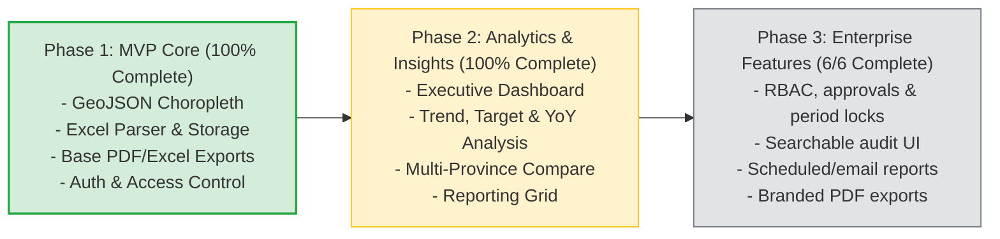

# Petakeu Product & Technical Roadmap

This document serves as the master roadmap and remaining work tracker for Petakeu. It synthesizes the status from the [Implementation Checklist](file:///home/noah/project/petakeu/docs/implementation-checklist.md) and outlines the phased strategy for ongoing and future development.

**Current Status Date:** 2026-08-12  
**Target Architecture:** Monolithic Express API + React FE + PostGIS + Redis + BullMQ + MinIO

---

## 1. Project Status Summary

The overall implementation status across all technical domains as of **2026-08-12**:

| Domain | Completed / Total | Progress | Visual Indicator | Status / Remaining Gap |
| :--- | :---: | :---: | :--- | :--- |
| **A. Foundation & Infra** | 4 / 4 | 100% | `[██████████]` | ✅ Complete |
| **B. API & Data** | 16 / 16 | 100% | `[██████████]` | ✅ Complete |
| **C. Frontend** | 7 / 7 | 100% | `[██████████]` | ✅ Complete |
| **D. Security** | 5 / 5 | 100% | `[██████████]` | ✅ Complete for MVP audit requirements |
| **E. Data Quality** | 5 / 5 | 100% | `[██████████]` | ✅ Complete |
| **F. Performance** | 5 / 5 | 100% | `[██████████]` | ✅ Complete |
| **G. Observability** | 4 / 4 | 100% | `[██████████]` | ✅ Complete for application-level telemetry |
| **H. Testing** | 8 / 8 | 100% | `[██████████]` | Integration, browser, load, and security suites added; live execution is infrastructure-gated |
| **Overall MVP Total** | **54 / 54** | **100%** | `[██████████]` | **Phase 1 and release-hardening implementation complete; deployment verification remains** |



---

## 2. Phase 1 — MVP (Current Phase)

Phase 1 establishes the operational core: ingesting regional financial data (setoran PPh/PPN), cleaning and storing records in PostGIS, rendering interactive national/regional choropleth maps with a 15% cut calculation (*Potongan 15%*), and providing basic report generation.

### ✅ Completed Items
- **Region Master & Geospatial Data:** Ingestion and seeding of BPS regional hierarchy (provinsi, kabupaten/kota, kecamatan, desa/kelurahan) with GIST spatial indexing.
- **Excel Importer & Data Cleaning:** Multipart file upload pipeline with SHA-256 deduplication, schema validation, period normalization (`YYYY-MM-01`), and transactional upsert into `payments`.
- **Monthly Records & Missing Data Detection:** Tracking of monthly records with automated materialized view refresh triggers.
- **Fiscal & Financial Rankings:** FiscalView ranking endpoints (`/api/rank`, `/api/surplus-defisit`), RankFin tier league tables (`/api/rankfin/league`), and DefisitWatch watchlist (`/api/defisitwatch/watchlist`).
- **Excel & PDF Exports:** Asynchronous job processing via BullMQ worker producing presigned MinIO download URLs.
- **Full Frontend Application:** React + Leaflet map client with 5-class quantile legend, period selection, public/private view toggles, upload drag-and-drop dashboard, and job status monitoring.
- **Infrastructure & Storage Services:** Docker Compose orchestration for API, Web, Postgres/PostGIS, Redis, MinIO, and BullMQ worker.
- **Authentication:** Bearer JWT middleware with environment bypass switch (`AUTH_DISABLED`).

### 📋 Remaining Work (MVP Completion Criteria)
- [x] **Health Check Endpoint (`GET /healthz`):** Implement full readiness check probing API, Redis connection, BullMQ worker status, PostGIS DB query, and MinIO storage bucket accessibility.
- [x] **Redis Cache for Choropleth GeoJSON:** Implement Redis caching layer with key structure `choropleth:{period}:{level}:{parent}`, configurable TTL (e.g., 1 hour), and explicit cache invalidation on successful file uploads.
- [x] **Full Report Content:** Extend PDF/Excel report generator to include top 10 region rankings, sparkline mini-choropleth summaries, and complete per-region payment comparison tables.
- [x] **Audit Logging System:** Implement immutable audit logging table (`audit_logs`) and middleware recording action timestamp, `user_id`, endpoint, IP address, file upload hashes, and report requests.
- [x] **Future Period Warning Flag:** Add validation rule checking incoming upload periods against `CURRENT_DATE`. Flag future periods with `forecast=false` warning without rejecting valid historic data.
- [x] **Redis Cache for Aggregations:** Cache heavy summary endpoints (`/api/regions/:id/summary`) with TTL invalidation.
- [x] **Streaming Response for Large Exports:** Refactored `report-worker.ts` to use `ExcelJS.stream.xlsx.WorkbookWriter` and PDFKit `PassThrough` stream piped directly to MinIO via `uploadReportStream` — no full `Buffer` materialised in V8 heap.
- [x] **Performance Benchmarking:** Self-contained benchmark script at `scripts/benchmark-perf.ts` (`pnpm benchmark`) measures p50/p95/p99 latency under ≥ 10 req/sec load, with separate cache-hit (< 300ms) and cold-miss (< 2s) SLA verdict and `--json` CI output.

---

## 3. Phase 2 — Analytics & Insights

Phase 2 focuses on turning raw financial payment records into actionable decision support analytics for regional executive leadership.

- [x] **Interactive Analytics Dashboard:** KPI cards displaying national total setoran, month-over-month growth, active reporting coverage, and top outlier regions.
- [x] **Monthly Revenue Trend Visualization:** Dynamic monthly trend chart with actual-versus-target series and seasonal range support.
- [x] **Top/Bottom Region Comparison:** Side-by-side comparison tool comparing top performing vs lagging kabupaten/kota within selected provinces.
- [x] **Target vs. Actual Analysis:** Target registration API/model plus variance and achievement visualization.
- [x] **Multi-Province Comparison:** Cross-province analytical view for comparative regional fiscal performance.
- [x] **Historical Data (YoY Comparison):** Year-over-year growth analytics matching current month against the same month of previous fiscal years (`period` vs `period - 12 months`).
- [x] **Region Reporting Matrix:** Visual grid (✅ Reporting / ❌ Missing / ⚠️ Delayed) displaying submission compliance across all 514 kabupaten/kota.

---

## 4. Phase 3 — Enterprise Features

Phase 3 introduces enterprise governance, multi-tenant RBAC, workflow approvals, and institutional reporting.

- [x] **Role-Based Access Control (RBAC):** Enforce strict role hierarchy (`public`, `viewer`, `operator`, `admin`):
  - `public`: Aggregated color quantiles only (no raw currency values).
  - `viewer`: Read-only access to detailed numbers and reports.
  - `operator`: Upload data, trigger re-parsing, request exports.
  - `admin`: User management, audit logs, system configuration.
- [x] **Data Approval Workflow:** Multi-stage review workflow for uploaded payment files (Draft → Under Review → Approved → Published), with append-only transition history.
- [x] **Data Locking:** Ability to freeze and lock fiscal periods post-approval to prevent inadvertent overwrites or historical modification.
- [x] **Enterprise Audit Trail UI:** Searchable, filterable, paginated log inspector in the admin shell; API RBAC remains authoritative.
- [x] **Scheduled & Automated Reports:** Configurable weekly/monthly cron jobs enqueue idempotent executive-summary PDFs and dispatch completed files through an SMTP-backed BullMQ email worker.
- [x] **Branded PDF Reports:** Optional bounded text and PNG/JPEG data-URI branding for PDF headers, footers, logos, and official signatures; unbranded output remains backward-compatible.

---

## 5. Testing Roadmap

The complete **8/8 test coverage set is now present**. Integration and live security checks are opt-in because they require PostgreSQL/PostGIS, Redis, MinIO, BullMQ, and a running API; deployment verification is still required before production release.

```
apps/server/src/
├── integration/
│   ├── upload-pipeline.integration.test.ts
│   └── report-generation.integration.test.ts
apps/web/e2e/
├── release-hardening.spec.ts
└── security-contracts.spec.ts
scripts/
├── choropleth-load.k6.js
└── run-choropleth-load.mjs
```

### 📋 Actionable Checklist
- [x] **Unit Tests — Core Calculations:** Test period normalization (`2026-08` → `2026-08-01`), BPS regional code pattern matching, and 5-class quantile classification algorithm edges.
- [x] **Unit Tests — Excel Parser:** Test parser resilience against header variations, invalid/future periods, blank/error rows, and numeric parsing paths.
- [x] **Integration Tests — Ingestion Pipeline:** Opt-in real integration test covers `POST /api/uploads` → BullMQ → `payments` → materialized-view refresh and cache invalidation (`PETAKEU_INTEGRATION=1`).
- [x] **Integration Tests — Report Generation:** Opt-in real integration test covers report queue execution, MinIO persistence, workbook output, and presigned URL expiry.
- [x] **E2E Tests — Map & Detail UI:** Playwright coverage verifies map initialization, legend/layer interaction, feature detail, and download behavior.
- [x] **E2E Tests — RBAC Enforcement:** Live opt-in contracts verify public redaction and role-specific upload/detail access.
- [x] **Load Testing — Cache Effectiveness:** k6 script and dependency-free Node fallback execute ≥10 req/sec warm/cold scenarios and emit p95 SLA JSON.
- [x] **Security Testing:** Live opt-in contracts verify public payload redaction and future presigned URL expiry metadata.

The opt-in live suites are intentionally skipped when their required services or tokens are unavailable; a skipped local run is not a production readiness verdict.

---

## 6. Observability Roadmap

Application-level observability is **100% implemented**. Deployment still needs Prometheus/Grafana wiring and an alert receiver in each environment.

- [x] **Structured JSON Logging:** Standardized log formatter attaching contextual metadata (`request_id`, `user_id`, `region_code`, `period`, `duration_ms`) across express requests and BullMQ jobs.
- [x] **Application & System Metrics:** Prometheus metric instrumentation tracking:
  - Cache hit/miss rates (`petakeu_cache_hits_total`, `petakeu_cache_misses_total`)
  - DB query latency (`petakeu_db_query_duration_seconds`)
  - Background job duration (`petakeu_worker_job_duration_seconds`)
  - Generated GeoJSON payload size (`petakeu_geojson_bytes`)
- [x] **OpenTelemetry Tracing:** OpenTelemetry auto-instrumentation covering HTTP request entry points, PostGIS query spans, Redis operations, and BullMQ worker jobs.
- [x] **Alerting & Dashboarding:** Grafana dashboard and Prometheus alert rules for BullMQ job failure rate spikes (`> 5%`), Excel parsing error spikes, and API response degradation.

---

## 7. Explicitly Deferred Features

The following features have been evaluated and **explicitly deferred** to maintain project focus, simplicity, and architectural stability:

| Feature / Architecture | Status | Justification & Alternative |
| :--- | :---: | :--- |
| **AI / LLM Financial Insights** | 🛑 Deferred | Deterministic statistical validation (quantile bounds, YoY variance percentages, 15% cut calculations) provides guaranteed accuracy and zero hallucination risk for financial auditing. |
| **Microservices Architecture** | 🛑 Deferred | A single modular Express application serving REST endpoints alongside dedicated BullMQ worker processes provides simple deployment, low overhead, and sufficient throughput. |
| **Apache Kafka Message Bus** | 🛑 Deferred | Redis + BullMQ provides reliable distributed queues, retries, and job tracking without the operational complexity of a Kafka cluster. |
| **Kubernetes (K8s) Deployment** | 🛑 Deferred | Docker Compose / Single-node Docker Swarm / Managed container service (e.g. AWS ECS / GCP Cloud Run) is sufficient for current traffic demands. |

---

## Related Documentation
- [Implementation Checklist](file:///home/noah/project/petakeu/docs/implementation-checklist.md)
- [Testing Strategy](file:///home/noah/project/petakeu/docs/testing-strategy.md)
- [Error Handling & Observability](file:///home/noah/project/petakeu/docs/error-handling-observability.md)
- [Security Specifications](file:///home/noah/project/petakeu/docs/security.md)
- [Data Model & Schema](file:///home/noah/project/petakeu/docs/data-model.md)
