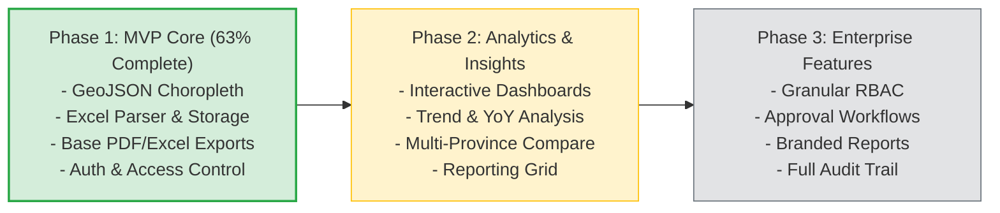

# Petakeu Product & Technical Roadmap

This document serves as the master roadmap and remaining work tracker for Petakeu. It synthesizes the status from the [Implementation Checklist](file:///home/noah/project/petakeu/docs/implementation-checklist.md) and outlines the phased strategy for ongoing and future development.

**Current Status Date:** 2026-08-03  
**Target Architecture:** Monolithic Express API + React FE + PostGIS + Redis + BullMQ + MinIO

---

## 1. Project Status Summary

The overall implementation status across all technical domains as of **2026-08-03**:

| Domain | Completed / Total | Progress | Visual Indicator | Status / Remaining Gap |
| :--- | :---: | :---: | :--- | :--- |
| **A. Foundation & Infra** | 3 / 4 | 75% | `[███████░░░]` | Missing health check readiness worker & storage ping |
| **B. API & Data** | 14 / 16 | 87.5% | `[█████████░]` | Missing Redis cache for choropleth & full report content |
| **C. Frontend** | 7 / 7 | 100% | `[██████████]` | ✅ Complete |
| **D. Security** | 4 / 5 | 80% | `[████████░░]` | Missing comprehensive audit log |
| **E. Data Quality** | 4 / 5 | 80% | `[████████░░]` | Missing future period warning flag (`forecast=false`) |
| **F. Performance** | 2 / 5 | 40% | `[████░░░░░░]` | Missing Redis cache, streaming export & p95 benchmarking |
| **G. Observability** | 0 / 4 | 0% | `[░░░░░░░░░░]` | Not started |
| **H. Testing** | 0 / 8 | 0% | `[░░░░░░░░░░]` | Not started |
| **Overall MVP Total** | **34 / 54** | **63%** | `[██████░░░░]` | **Phase 1 MVP in progress** |



---

## 2. Phase 1 — MVP (Current Phase)

Phase 1 establishes the operational core: ingesting regional financial data (setoran PPh/PPN), cleaning and storing records in PostGIS, rendering interactive national/regional choropleth maps with a 15% cut calculation (*Potongan 15%*), and providing basic report generation.

### ✅ Completed Items
- **Region Master & Geospatial Data:** Ingestion and seeding of BPS regional hierarchy (provinsi, kabupaten/kota, kecamatan, desa/kelurahan) with GIST spatial indexing.
- **Excel Importer & Data Cleaning:** Multipart file upload pipeline with SHA-256 deduplication, schema validation, period normalization (`YYYY-MM-01`), and transactional upsert into `payments`.
- **Monthly Records & Missing Data Detection:** Tracking of monthly records with automated materialized view refresh triggers.
- **Fiscal & Financial Rankings:** FiscalView ranking endpoints (`/api/rank`, `/api/surplus-defisit`), RankFin tier league tables (`/api/rankfin/league`), and DefisitWatch watchlist (`/api/defisitwatch/watchlist`).
- **Excel & PDF Exports:** Asynchronous job processing via BullMQ worker producing presigned MinIO download URLs.
- **Full Frontend Application:** React + Leaflet map client with 5-class quantile legend, period selection, public/private view toggles, upload drag-and-drop dashboard, and job status monitoring.
- **Infrastructure & Storage Services:** Docker Compose orchestration for API, Web, Postgres/PostGIS, Redis, MinIO, and BullMQ worker.
- **Authentication:** Bearer JWT middleware with environment bypass switch (`AUTH_DISABLED`).

### 📋 Remaining Work (MVP Completion Criteria)
- [x] **Health Check Endpoint (`GET /healthz`):** Implement full readiness check probing API, Redis connection, BullMQ worker status, PostGIS DB query, and MinIO storage bucket accessibility.
- [x] **Redis Cache for Choropleth GeoJSON:** Implement Redis caching layer with key structure `choropleth:{period}:{level}:{parent}`, configurable TTL (e.g., 1 hour), and explicit cache invalidation on successful file uploads.
- [x] **Full Report Content:** Extend PDF/Excel report generator to include top 10 region rankings, sparkline mini-choropleth summaries, and complete per-region payment comparison tables.
- [x] **Audit Logging System:** Implement immutable audit logging table (`audit_logs`) and middleware recording action timestamp, `user_id`, endpoint, IP address, file upload hashes, and report requests.
- [x] **Future Period Warning Flag:** Add validation rule checking incoming upload periods against `CURRENT_DATE`. Flag future periods with `forecast=false` warning without rejecting valid historic data.
- [x] **Redis Cache for Aggregations:** Cache heavy summary endpoints (`/api/regions/:id/summary`) with TTL invalidation.
- [ ] **Streaming Response for Large Exports:** Implement chunked response streaming (Node stream / ExcelJS streaming writer) to prevent memory exhaustion when exporting large multi-region datasets.
- [ ] **Performance Benchmarking:** Validate response timing SLA: p95 `< 300ms` for cache hits, `< 2s` for cold database queries on national level choropleth.

---

## 3. Phase 2 — Analytics & Insights

Phase 2 focuses on turning raw financial payment records into actionable decision support analytics for regional executive leadership.

- [ ] **Interactive Analytics Dashboard:** KPI cards displaying national total setoran, month-over-month growth, active reporting coverage, and top outlier regions.
- [ ] **Monthly Revenue Trend Visualization:** Dynamic multi-line and stacked area charts tracking monthly collection patterns and seasonal variance.
- [ ] **Top/Bottom Region Comparison:** Side-by-side comparison tool comparing top performing vs lagging kabupaten/kota within selected provinces.
- [ ] **Target vs. Actual Analysis:** Interface and data model extensions to register revenue targets and visualize variance (% of budget target realized).
- [ ] **Multi-Province Comparison:** Cross-province analytical view for comparative regional fiscal performance.
- [ ] **Historical Data (YoY Comparison):** Year-over-year growth analytics matching current month against the same month of previous fiscal years (`period` vs `period - 12 months`).
- [ ] **Region Reporting Matrix:** Visual grid (✅ Reporting / ❌ Missing / ⚠️ Delayed) displaying submission compliance across all 514 kabupaten/kota.

---

## 4. Phase 3 — Enterprise Features

Phase 3 introduces enterprise governance, multi-tenant RBAC, workflow approvals, and institutional reporting.

- [ ] **Role-Based Access Control (RBAC):** Enforce strict role hierarchy (`public`, `viewer`, `operator`, `admin`):
  - `public`: Aggregated color quantiles only (no raw currency values).
  - `viewer`: Read-only access to detailed numbers and reports.
  - `operator`: Upload data, trigger re-parsing, request exports.
  - `admin`: User management, audit logs, system configuration.
- [ ] **Data Approval Workflow:** Multi-stage review workflow for uploaded payment files (Draft → Under Review → Approved → Published).
- [ ] **Data Locking:** Ability to freeze and lock fiscal periods post-approval to prevent inadvertent overwrites or historical modification.
- [ ] **Enterprise Audit Trail UI:** Searchable log inspector in admin dashboard for compliance monitoring.
- [ ] **Scheduled & Automated Reports:** Cron-based automated generation and email dispatch of weekly/monthly executive summary PDFs.
- [ ] **Branded PDF Reports:** Customizable PDF templates supporting organizational logos, custom headers, footers, and official signatures.

---

## 5. Testing Roadmap

Currently at **0% coverage**. Systematic testing suite implementation is required before production deployment.

```
tests/
├── unit/
│   ├── normalize-period.test.ts
│   ├── bps-code-validator.test.ts
│   ├── quantile-calculator.test.ts
│   └── excel-parser.test.ts
├── integration/
│   ├── upload-pipeline.test.ts
│   └── report-generation.test.ts
├── e2e/
│   ├── map-interaction.spec.ts
│   └── rbac-access.spec.ts
└── performance/
    └── choropleth-load.k6.js
```

### 📋 Actionable Checklist
- [ ] **Unit Tests — Core Calculations:** Test period normalization (`2026-08` → `2026-08-01`), BPS regional code pattern matching, and 5-class quantile classification algorithm edges.
- [ ] **Unit Tests — Excel Parser:** Test parser resilience against header variations (`kode_daerah`, `Kode BPS`, `Setoran (Rp)`), blank rows, mixed data types, and locale formatting (`1.234.567,89` vs `1234567.89`).
- [ ] **Integration Tests — Ingestion Pipeline:** End-to-end integration test: `POST /api/uploads` → BullMQ queue dispatch → worker execution → `payments` table populated → PostGIS choropleth view refreshed.
- [ ] **Integration Tests — Report Generation:** Test report job creation (`POST /api/reports/export`), background execution, MinIO object persistence, and presigned URL retrieval.
- [ ] **E2E Tests — Map & Detail UI:** Playwright/Cypress automation verifying map initialization, layer toggling, feature click event, detail panel rendering, and download modal.
- [ ] **E2E Tests — RBAC Enforcement:** Verification that unauthenticated and `public` users cannot view exact setoran figures or access administrative upload panels.
- [ ] **Load Testing — Cache Effectiveness:** K6 load testing script executing 10+ req/sec on national choropleth endpoint to measure cache hit ratio and p95 latency under concurrent load.
- [ ] **Security Testing:** Automated verification that public API endpoints do not leak detail payloads and presigned S3 URLs expire correctly within designated TTL.

---

## 6. Observability Roadmap

Currently at **0% implementation**. Observability tooling will provide runtime visibility into system performance and background processing.

- [ ] **Structured JSON Logging:** Standardized log formatter attaching contextual metadata (`request_id`, `user_id`, `region_code`, `period`, `duration_ms`) across express requests and BullMQ jobs.
- [ ] **Application & System Metrics:** Prometheus metric instrumentation tracking:
  - Cache hit/miss rates (`petakeu_cache_hits_total`, `petakeu_cache_misses_total`)
  - DB query latency (`petakeu_db_query_duration_seconds`)
  - Background job duration (`petakeu_worker_job_duration_seconds`)
  - Generated GeoJSON payload size (`petakeu_geojson_bytes`)
- [ ] **OpenTelemetry Tracing:** OpenTelemetry auto-instrumentation covering HTTP request entry points, PostGIS query spans, Redis operations, and BullMQ worker jobs.
- [ ] **Alerting & Dashboarding:** Grafana dashboard and alert triggers for BullMQ job failure rate spikes (`> 5%`), Excel parsing error spikes, and API response degradation.

---

## 7. Explicitly Deferred Features

The following features have been evaluated and **explicitly deferred** to maintain project focus, simplicity, and architectural stability:

| Feature / Architecture | Status | Justification & Alternative |
| :--- | :---: | :--- |
| **AI / LLM Financial Insights** | 🛑 Deferred | Deterministic statistical validation (quantile bounds, YoY variance percentages, 15% cut calculations) provides guaranteed accuracy and zero hallucination risk for financial auditing. |
| **Microservices Architecture** | 🛑 Deferred | A single modular Express application serving REST endpoints alongside dedicated BullMQ worker processes provides simple deployment, low overhead, and sufficient throughput. |
| **Apache Kafka Message Bus** | 🛑 Deferred | Redis + BullMQ provides reliable distributed queues, retries, and job tracking without the operational complexity of a Kafka cluster. |
| **Kubernetes (K8s) Deployment** | 🛑 Deferred | Docker Compose / Single-node Docker Swarm / Managed container service (e.g. AWS ECS / GCP Cloud Run) is sufficient for current traffic demands. |

---

## Related Documentation
- [Implementation Checklist](file:///home/noah/project/petakeu/docs/implementation-checklist.md)
- [Testing Strategy](file:///home/noah/project/petakeu/docs/testing-strategy.md)
- [Error Handling & Observability](file:///home/noah/project/petakeu/docs/error-handling-observability.md)
- [Security Specifications](file:///home/noah/project/petakeu/docs/security.md)
- [Data Model & Schema](file:///home/noah/project/petakeu/docs/data-model.md)
