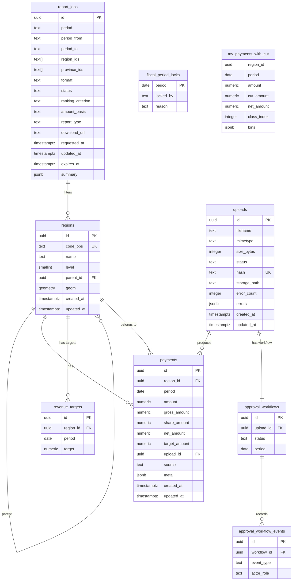

# Database Schema Documentation

Complete reference for the Petakeu PostgreSQL/PostGIS database schema.

---

## Entity Relationship Diagram



---

## Table Definitions

### 1. `regions` - Administrative Boundaries

Stores Indonesian administrative regions (province, regency, district, village) with PostGIS geometry.

| Column | Type | Constraints | Description |
|--------|------|-------------|-------------|
| `id` | `UUID` | `PRIMARY KEY` | Unique identifier (gen_random_uuid()) |
| `code_bps` | `TEXT` | `UNIQUE NOT NULL` | BPS statistical code (e.g., "3171", "3374") |
| `name` | `TEXT` | `NOT NULL` | Official region name |
| `level` | `SMALLINT` | `NOT NULL CHECK (1-4)` | 1=province, 2=regency, 3=district, 4=village |
| `parent_id` | `UUID` | `FK → regions.id ON DELETE SET NULL` | Parent region (province for regencies) |
| `geom` | `GEOMETRY(MultiPolygon, 4326)` | `NOT NULL` | PostGIS geometry in WGS84 |
| `created_at` | `TIMESTAMPTZ` | `NOT NULL DEFAULT NOW()` | Creation timestamp |
| `updated_at` | `TIMESTAMPTZ` | `NOT NULL DEFAULT NOW()` | Last update timestamp |

**Indexes:**
- `regions_level_idx` ON `level` - Filter by administrative level
- `regions_geom_idx` ON `geom USING GIST` - Spatial queries (bounding box, contains, intersects)

**Sample Data:**
```sql
INSERT INTO regions (id, code_bps, name, level, parent_id, geom) VALUES
  ('a0eebc99-9c0b-4ef8-bb6d-6bb9bd380a11', '31', 'DKI Jakarta', 1, NULL, ST_GeomFromText('MULTIPOLYGON(((...)))', 4326)),
  ('b0eebc99-9c0b-4ef8-bb6d-6bb9bd380a12', '3171', 'Kota Jakarta Selatan', 2, 'a0eebc99-9c0b-4ef8-bb6d-6bb9bd380a11', ST_GeomFromText('MULTIPOLYGON(((...)))', 4326));
```

---

### 2. `payments` - Payment Records

Stores raw payment data from Excel uploads after validation and parsing.

| Column | Type | Constraints | Description |
|--------|------|-------------|-------------|
| `id` | `UUID` | `PRIMARY KEY` | Unique identifier |
| `region_id` | `UUID` | `NOT NULL FK → regions.id ON DELETE CASCADE` | Reference to region |
| `period` | `DATE` | `NOT NULL` | First day of month (e.g., 2025-08-01) |
| `amount` | `NUMERIC(18,2)` | `NOT NULL CHECK (amount >= 0)` | Backward-compatible gross payment amount in IDR |
| `gross_amount` | `NUMERIC(18,2)` | `NOT NULL CHECK (gross_amount >= 0)` | Canonical source gross amount |
| `share_amount` | `NUMERIC(18,2)` | `NOT NULL CHECK (share_amount >= 0)` | Submitted/provincial 15% share |
| `net_amount` | `NUMERIC(18,2)` | `NOT NULL CHECK (net_amount >= 0)` | Canonical net amount after share |
| `target_amount` | `NUMERIC(18,2)` | `CHECK (target_amount IS NULL OR target_amount >= 0)` | Optional target captured with the upload |
| `upload_id` | `UUID` | `FK → uploads.id ON DELETE SET NULL` | Upload provenance |
| `source` | `TEXT` | `NOT NULL` | Payment source (e.g., "PAD", "DBH", "DAU", "DAK", "Lainnya") |
| `meta` | `JSONB` | `NOT NULL DEFAULT '{}'` | Additional metadata (sheet name, row number, etc.) |
| `created_at` | `TIMESTAMPTZ` | `NOT NULL DEFAULT NOW()` | Creation timestamp |
| `updated_at` | `TIMESTAMPTZ` | `NOT NULL DEFAULT NOW()` | Last update timestamp |

**Indexes:**
- `payments_unique_period` ON `(region_id, period, source)` UNIQUE - Prevent duplicate payments per region/period/source
- `payments_period_idx` ON `period` - Time-range queries

**Upsert Logic:**
```sql
INSERT INTO payments (region_id, period, amount, source, meta)
VALUES ($1, $2, $3, $4, $5)
ON CONFLICT (region_id, period, source) DO UPDATE SET
  amount = EXCLUDED.amount,
  meta = EXCLUDED.meta,
  updated_at = NOW();
```

---

### 3. `uploads` - File Upload Tracking

Tracks Excel file uploads, processing status, and validation errors.

| Column | Type | Constraints | Description |
|--------|------|-------------|-------------|
| `id` | `UUID` | `PRIMARY KEY` | Unique identifier (upload_id) |
| `filename` | `TEXT` | `NOT NULL` | Original filename |
| `mimetype` | `TEXT` | `NOT NULL` | MIME type (application/vnd.openxmlformats-officedocument.spreadsheetml.sheet) |
| `size_bytes` | `INTEGER` | `NOT NULL` | File size in bytes |
| `status` | `TEXT` | `NOT NULL DEFAULT 'queued'` | `queued`, `processing`, `parsing`, `parsed`, `awaiting_confirmation`, `committing`, `persisted`, `failed`, `cancelled` |
| `hash` | `TEXT` | `UNIQUE NOT NULL` | SHA-256 hash for deduplication |
| `storage_path` | `TEXT` | `NOT NULL` | Path in object storage (MinIO/S3) |
| `error_count` | `INTEGER` | `NOT NULL DEFAULT 0` | Number of validation errors |
| `errors` | `JSONB` | - | Array of error details: `[{row, column, message}]` |
| `created_at` | `TIMESTAMPTZ` | `NOT NULL DEFAULT NOW()` | Upload timestamp |
| `updated_at` | `TIMESTAMPTZ` | `NOT NULL DEFAULT NOW()` | Last status update |

**Error JSON Structure:**
```json
[
  {"row": 12, "column": "nominal", "message": "Nilai negatif tidak diperbolehkan"},
  {"row": 25, "column": "periode", "message": "Format periode harus YYYY-MM"}
]
```

Staged uploads also retain lifecycle actors/timestamps, row and warning
counters, and immutable findings in `upload_validation_findings`. Normalized
rows are stored in `staged_upload_rows` until atomic confirmation writes to
`payments`.

### 3a. `region_aliases` - Canonical Import Aliases

Stores active, scope-aware aliases for BPS regions. The unique active index is
scoped by normalized alias, administrative level, and parent province.

---

### 4. `report_jobs` - Report Generation Jobs

Tracks asynchronous report generation jobs.

| Column | Type | Constraints | Description |
|--------|------|-------------|-------------|
| `id` | `UUID` | `PRIMARY KEY` | Unique identifier (job_id) |
| `period` | `TEXT` | `NOT NULL` | Report period (YYYY-MM) |
| `period_from` / `period_to` | `TEXT` | - | Inclusive report range (YYYY-MM) |
| `region_ids` | `TEXT[]` | `NOT NULL` | Array of region IDs included |
| `province_ids` | `TEXT[]` | `NOT NULL DEFAULT '{}'` | Optional province filters |
| `format` | `TEXT` | `NOT NULL CHECK (pdf, excel)` | Output format |
| `status` | `TEXT` | `NOT NULL DEFAULT 'queued'` | `queued`, `processing`, `completed`, `failed` |
| `ranking_criterion` | `TEXT` | `NOT NULL DEFAULT 'total'` | Ranking metric used in the export |
| `amount_basis` | `TEXT` | `NOT NULL DEFAULT 'gross'` | `gross`, `share`, or `net` |
| `report_type` | `TEXT` | `NOT NULL DEFAULT 'full'` | `executive-summary`, `full`, or `missing-data` |
| `download_url` | `TEXT` | - | Presigned URL (valid 24h) |
| `requested_at` | `TIMESTAMPTZ` | `NOT NULL DEFAULT NOW()` | Job creation time |
| `updated_at` | `TIMESTAMPTZ` | `NOT NULL DEFAULT NOW()` | Last status update |
| `expires_at` | `TIMESTAMPTZ` | - | URL expiration (24h after completion) |
| `summary` | `JSONB` | - | Report summary data (totals, trends, etc.) |

**Summary JSON Structure:**
```json
{
  "totalsByRegion": [
    {"regionId": "...", "regionName": "Jakarta", "total": 1000000000, "changePercentage": 5.2}
  ],
  "topGainers": [...],
  "topDecliners": [...],
  "lastTwelveMonths": [
    {"period": "2024-09", "total": 950000000},
    {"period": "2024-10", "total": 1000000000}
  ]
}
```

---

### 5. `audit_logs` - Immutable Request Audit Trail

Migration `004_audit_logs.sql` creates the append-only request audit table.
It retains the event, actor, request correlation ID, endpoint, response status,
origin metadata, and structured details used by the audit query API.

### 6. `revenue_targets` - Monthly Analytics Targets

Migration `005_analytics_targets.sql` creates one non-negative target per
`(region_id, period)`. The period is normalized to the first day of its month
and references `regions(id)` with `ON DELETE CASCADE`.

### 7. `approval_workflows` and `approval_workflow_events`

Migration `006_approval_workflow.sql` stores one workflow per upload and an
append-only transition history. Valid statuses are `draft`, `under_review`,
`approved`, and `published`; invalid transitions and event mutation are
rejected by database triggers.

### 8. `fiscal_period_locks` and `fiscal_period_lock_events`

The active lock table contains one row per locked month. The event table
retains lock/unlock history. Database triggers call
`assert_fiscal_period_unlocked()` before writes to payments, report jobs,
revenue targets, and approval workflows.

### 9. `mv_payments_with_cut` - Materialized View

Pre-aggregated payments with 15% cut and quantile classification for fast choropleth queries.

| Column | Type | Description |
|--------|------|-------------|
| `region_id` | `UUID` | Region identifier |
| `period` | `DATE` | Month (first day) |
| `amount` | `NUMERIC(18,2)` | Total gross amount |
| `cut_amount` | `NUMERIC(18,2)` | 15% of amount |
| `net_amount` | `NUMERIC(18,2)` | Amount after 15% cut |
| `class_index` | `INTEGER` | Quantile class (0-4) |
| `bins` | `JSONB` | Quantile boundaries for legend |

**Bin Structure:**
```json
[
  {"index": 0, "min": 0, "max": 50000000},
  {"index": 1, "min": 50000000, "max": 150000000},
  {"index": 2, "min": 150000000, "max": 300000000},
  {"index": 3, "min": 300000000, "max": 600000000},
  {"index": 4, "min": 600000000, "max": 2000000000}
]
```

**Refresh Function:**
```sql
SELECT refresh_mv_payments_with_cut();
-- Or manually:
REFRESH MATERIALIZED VIEW CONCURRENTLY mv_payments_with_cut;
```

**Refresh Triggers:**
- After successful upload parsing (`status = 'parsed'`)
- Scheduled cron (daily at 02:00 WIB)
- On-demand via admin API

---

## Data Dictionary

### Region Levels

| Level | Code | Name (ID) | Name (EN) | Example |
|-------|------|-----------|-----------|---------|
| 1 | `province` | Provinsi | Province | DKI Jakarta |
| 2 | `regency` | Kabupaten/Kota | Regency/City | Kota Semarang |
| 3 | `district` | Kecamatan | District | Semarang Selatan |
| 4 | `village` | Kelurahan/Desa | Village | Mugassari |

### Payment Sources

| Source Code | Description (ID) | Description (EN) |
|-------------|------------------|------------------|
| `PAD` | Pendapatan Asli Daerah | Local Own-Source Revenue |
| `DBH` | Dana Bagi Hasil | Revenue Sharing Fund |
| `DAU` | Dana Alokasi Umum | General Allocation Fund |
| `DAK` | Dana Alokasi Khusus | Special Allocation Fund |
| `Lainnya` | Sumber Lainnya | Other Sources |

### Upload Statuses

| Status | Description | Next States |
|--------|-------------|-------------|
| `queued` | File received, waiting for processing | `processing` |
| `processing` | Parser running | `parsed`, `failed` |
| `parsed` | Successfully processed, data in `payments` | - |
| `failed` | Validation/parsing errors | - |

### Report Statuses

| Status | Description | Download URL |
|--------|-------------|--------------|
| `queued` | Job created, waiting for worker | - |
| `processing` | Generating report | - |
| `completed` | Ready for download | Presigned URL (24h) |
| `failed` | Generation error | - |

---

## Common Queries

### Get Regions with Parent Names
```sql
SELECT 
  r.id, r.code_bps, r.name, r.level,
  p.name AS parent_name
FROM regions r
LEFT JOIN regions p ON r.parent_id = p.id
WHERE r.level = 2
ORDER BY r.code_bps;
```

### Monthly Payment Summary by Region
```sql
SELECT 
  r.name,
  date_trunc('month', p.period)::date AS month,
  SUM(p.amount) AS total_amount
FROM payments p
JOIN regions r ON p.region_id = r.id
WHERE p.period >= '2025-01-01' AND p.period < '2025-12-01'
GROUP BY r.id, r.name, month
ORDER BY month, r.name;
```

### Choropleth Data (using Materialized View)
```sql
SELECT 
  r.id AS region_id,
  r.name,
  ST_AsGeoJSON(r.geom)::json AS geometry,
  m.amount,
  m.net_amount,
  m.class_index,
  m.bins
FROM mv_payments_with_cut m
JOIN regions r ON m.region_id = r.id
WHERE m.period = '2025-08-01'
  AND r.level = 2;
```

### Region Detail with Trends
```sql
SELECT 
  date_trunc('month', period)::date AS month,
  SUM(amount) AS total_amount
FROM payments
WHERE region_id = $1
  AND period >= $2
  AND period <= $3
GROUP BY month
ORDER BY month;
```

---

## Migration Notes

### Version 1 (Initial - `001_init.sql`)
- All tables created
- PostGIS extension enabled
- Materialized view with quantile classification
- Refresh function created

### Version 2 (`002_uploads_reports.sql`) ✅ Applied
- `uploads` table with status tracking, storage path, file URL, and JSONB error details
- `report_jobs` table with format, download_url, expiry, and JSONB summary
- `_migrations` tracking table auto-created by `src/db/migrate.ts`
- Migrations now run automatically at server startup — no manual `psql` required

### Applied Migrations
| Version | Description | Status |
|---------|-------------|--------|
| 003 | RankFin gamification tables and indexes | Applied |
| 004 | Immutable request audit trail (`audit_logs`) | Applied |
| 005 | Monthly analytics targets (`revenue_targets`) | Applied |
| 006 | Approval workflow, fiscal-period locks, and write-protection triggers | Applied |

### Future Migrations

| Version | Description | Status |
|---------|-------------|--------|
| 007+ | Optional historical boundary and payment partitioning work | Future |

---

## Performance Considerations

1. **Materialized View**: Primary query path for choropleth. Refresh CONCURRENTLY to avoid locks.
2. **GIST Index**: Essential for spatial queries on `regions.geom`.
3. **Unique Index**: `payments_unique_period` prevents duplicates and speeds upserts.
4. **Partitioning**: Consider partitioning `payments` by `period` when >10M rows.
5. **Connection Pooling**: Use PgBouncer in production (configure in `DATABASE_URL`).

---

## Backup & Recovery

```bash
# Full backup
pg_dump -h localhost -U petakeu -d petakeu > backup_$(date +%Y%m%d).sql

# Schema only
pg_dump -h localhost -U petakeu -d petakeu --schema-only > schema.sql

# Data only (exclude materialized view)
pg_dump -h localhost -U petakeu -d petakeu --data-only --exclude-table=mv_payments_with_cut > data.sql

# Restore
psql -h localhost -U petakeu -d petakeu < backup_20250803.sql
```

**Point-in-Time Recovery**: Enable WAL archiving on production PostgreSQL.
